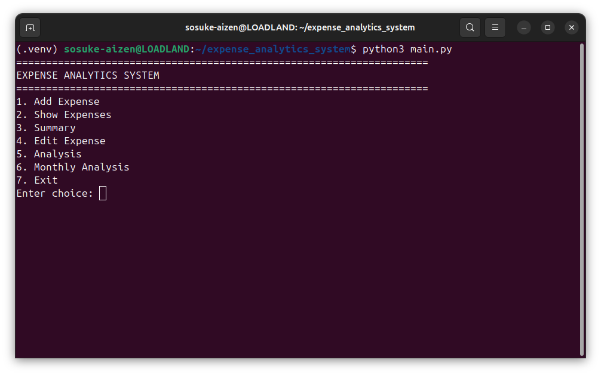
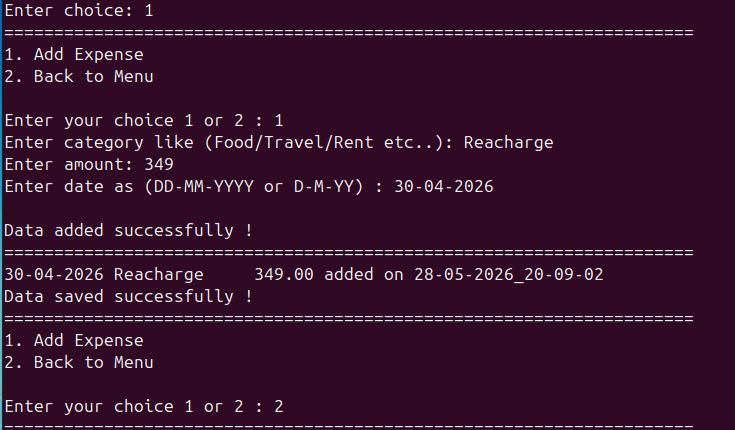
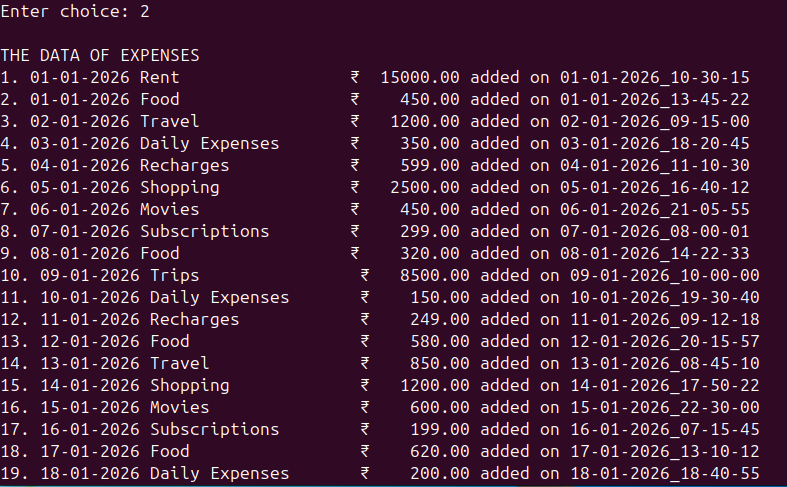
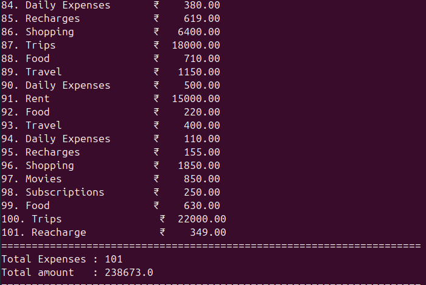
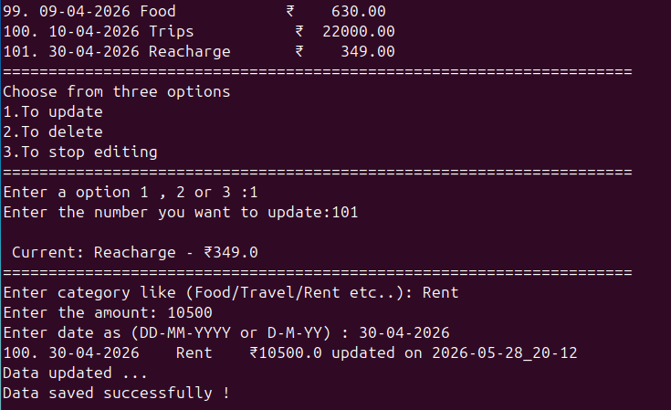
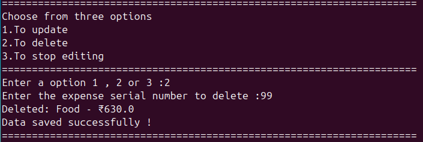
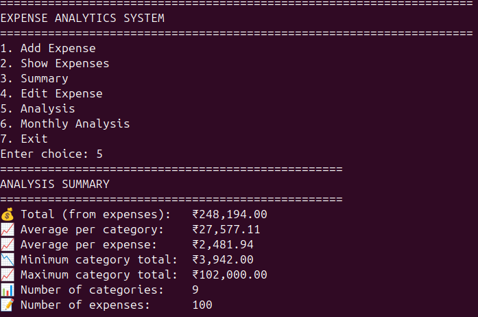
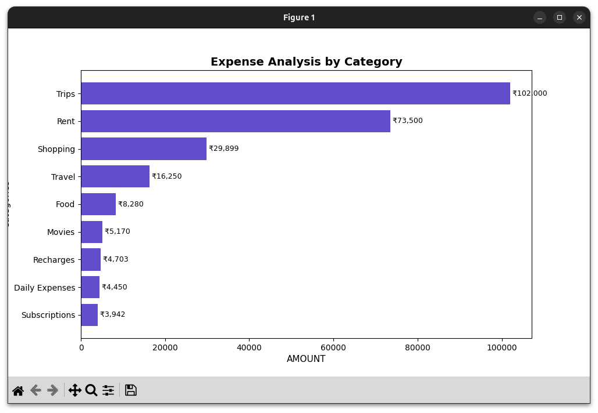
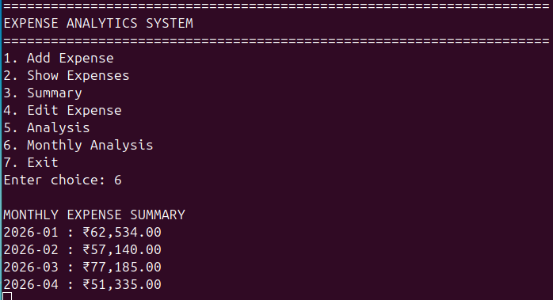
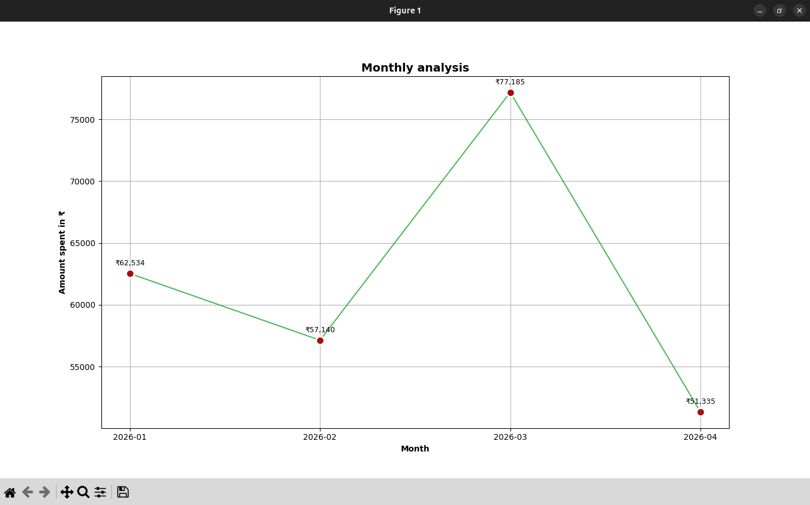

# Expense Analytics & Visualization System

A Python-based CLI application for tracking, analyzing, and visualizing personal expenses.

This project allows users to:

* Add, update, and delete expenses
* Analyze expense data
* View monthly expense trends
* Generate category-wise analysis
* Export charts and CSV reports

---

## Features

* CRUD operations
* Expense analysis using Pandas
* Monthly trend analysis
* Category-wise analysis
* Data visualization using Matplotlib
* CSV export support
* PNG chart export
* JSON-based data storage
* Timestamp tracking

---

## Technologies Used

* Python
* Pandas
* Matplotlib
* JSON

---

## Project Structure

        expense_analytics_system/
        │       
        ├── main.py
        ├── data/
        │   └── expenses.json
        │
        ├── exports/
        │   ├── charts/
        │   └── csv/
        │
        ├── modules/
        │   ├── analytics.py
        │   ├── expense_manager.py
        │   ├── file_handler.py
        │   └── utils.py
        │       
        ├── screenshots/
        ├── requirements.txt
        └── README.md

---

## How to Run

### 1. Install Dependencies

        pip install -r requirements.txt

### 2. Run the Project

        python main.py

or

        python3 main.py

---

## Screenshots

### Main Menu

### Adding an Expense

### Expense List

### Expense Summary

### Updating an Expense

### Deleting an Expense

### Complete Analysis

### Category Analysis Visualization

### Monthly Analysis

### Monthly Trend Visualization

---

## Future Improvements

* Streamlit dashboard
* SQL database integration
* Advanced filtering
* Decision-making insights
* User authentication

---

## Author

Developed by Kullayiswamy, a BSc AI student, as a portfolio and learning project using Python, Pandas, and Matplotlib.